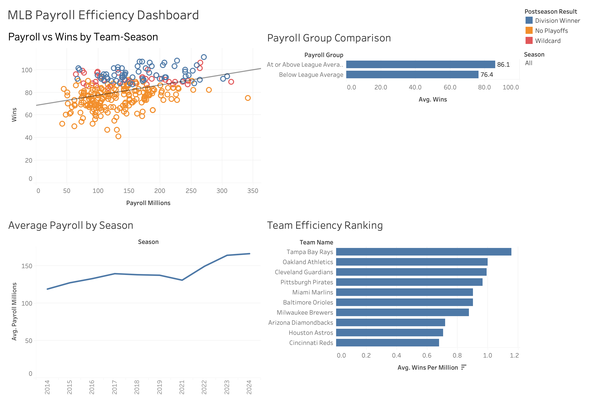

# MLB Payroll Efficiency Analysis

This project analyzes 300 MLB team-seasons across 2014–2019 and 2021–2024 to examine the relationship between team payroll, wins, and postseason qualification.



## Question

How is higher payroll associated with winning, and which teams achieved strong results with below-average payroll?

## Tools

- Python and Pandas
- SQLite and SQL
- Tableau

## Dataset

Source: [MLB Team Payrolls 2011–2024 by Christopher Treasure](https://www.kaggle.com/datasets/christophertreasure/mlb-team-payrolls-2011-2024/data)

The source dataset contains payroll and performance data for all 30 MLB teams from 2011–2024. This analysis uses ten full seasons and excludes the shortened 2020 season.

## Process

1. Cleaned and filtered the source data with Pandas.
2. Checked data types, missing values, and duplicate team-season records.
3. Created seven calculated fields for payroll, performance, and efficiency.
4. Loaded the cleaned data into SQLite and analyzed it with SQL.
5. Built an interactive Tableau dashboard with a season filter.

## Key Findings

- Teams spending at or above the league-average payroll won **86.1 games per season**, compared with **76.4 wins** for below-average teams.
- Teams spending at or above the league-average payroll reached the postseason in **47.9%** of team-seasons, compared with **22.8%** for below-average teams.
- Average team payroll increased from **$119.15 million in 2014** to **$166.60 million in 2024**, an increase of approximately **40%**.
- High spending did not guarantee success. The 2023 New York Mets spent **$341.67 million** but won only **75 games** and missed the playoffs.
- The Tampa Bay Rays, Cleveland Guardians, and Milwaukee Brewers repeatedly produced strong results with relatively low payrolls.

## Conclusion

Higher payroll was associated with more wins and a greater likelihood of reaching the postseason. However, several low-payroll teams consistently performed efficiently, while some high-payroll teams underperformed. Payroll was related to performance, but it did not explain every team's results.

## Repository Structure

```text
notebooks/
└── 01_data_cleaning.ipynb

sql/
└── analysis_queries.sql

tableau/
└── mlb_payroll_efficiency_dashboard.twb

images/
└── mlb_payroll_efficiency_dashboard.png

README.md
requirements.txt
```

The raw data, processed CSV, and SQLite database are stored locally and excluded from GitHub.

## Limitations

- This is an observational analysis and does not establish that payroll causes better performance.
- The data is aggregated at the team-season level.
- The shortened 2020 season was excluded for comparability.
- Wins per million tends to reward low-payroll teams, so it should be considered alongside total wins and postseason results.
